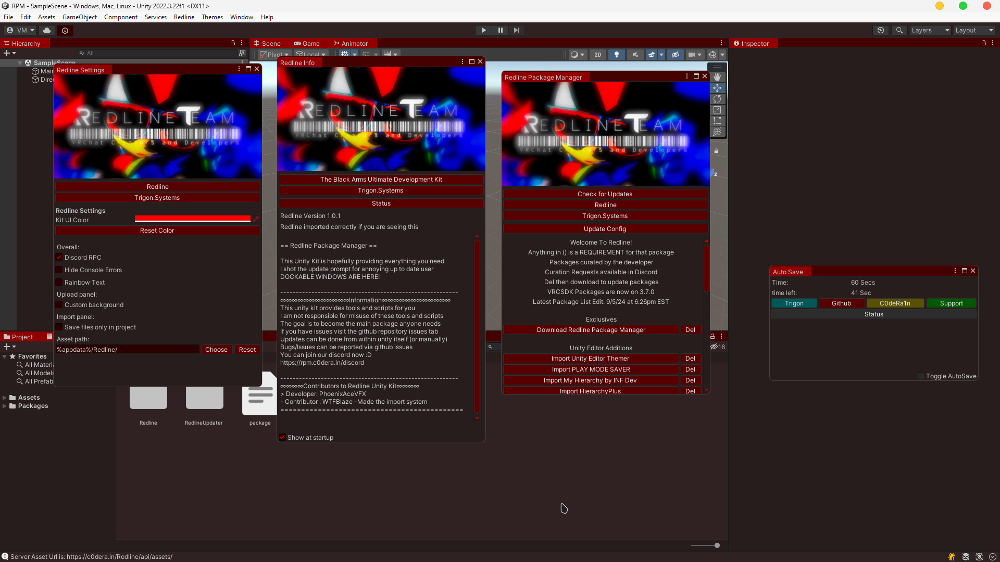

  

# CURRENT DOWNTIME  
Due to our hosting provider moving locations  
Our server is offline disabling the importer  
The autosaver and themer will work still  
Only the Package Manager is affected  
This notice will be removed when it's back online  
You can use our [RLIST](https://redline-team.github.io/RedlineList) with VCC/ALCOM still  

  
  
  

  
# Redline Package Manager  
An attempt at replacing the VRChat Creator Companion with something directly in Unity  
This came as I got tired of tabbing out of Unity to import things so I decided to make this  
Currently as it stands Redline is a Curated Package Manager developed and curated by me  
Curation requests have been opened in the discord if you wish to request a pacakge be added  

# Installation  
## Traditional Package  
Download the [latest release](https://github.com/Redline-Team/RPM/releases/latest) and import it into unity  
You can import by drag and dropping into assets or double clicking the package while unity is open  
## VRChat Creator Companion  
You can add our VCC Repository to ALCOM/VCC  
[Main Redline Repo URL](https://rpmrepo.c0dera.in)  
[Backup Redline Repo URL](https://redline-team.github.io/RedlineVCC/)  
## BLEEDING EDGE BUILDS  
This repository auto builds BLEEDING EDGE packages  
Using these can have unexpected issues  
  

