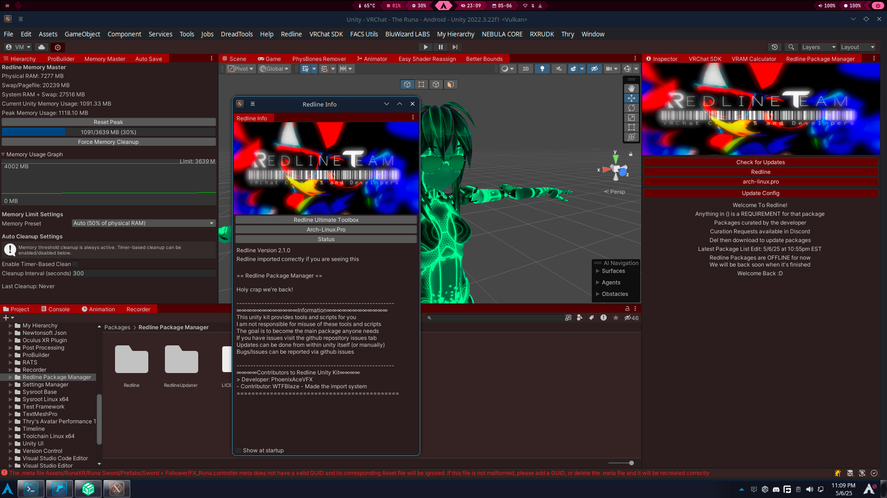

  

  
  

# Redline Package Manager  
An attempt at replacing the VRChat Creator Companion with something directly in Unity  
This came as I got tired of tabbing out of Unity to import things so I decided to make this  
Currently as it stands Redline is a Curated Package Manager developed and curated by me  
Curation requests have been opened in the discord if you wish to request a pacakge be added  

# Installation  
## Traditional Package  
Download the [latest release](https://github.com/Redline-Team/RPM/releases/latest) and import it into unity  
You can import by drag and dropping into assets or double clicking the package while unity is open  
## VRChat Creator Companion/ALCOM  
You can add our VCC Repository to ALCOM/VCC  
[Main Redline Repo URL](https://rpmrepo.arch-linux.pro)  
[Backup Redline Repo URL](https://redline-team.github.io/RedlineVCC/)  
## BLEEDING EDGE BUILDS  
This repository auto builds BLEEDING EDGE packages  
Using these can have unexpected issues  
  

