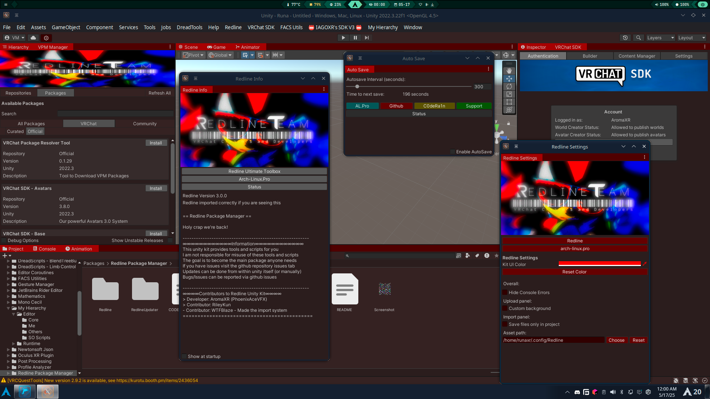

> **⚠️ WARNING: V3 is not backwards compatible with V2 ⚠️**  
> You may have to manually remove the old package folder (`dev.runaxr.redline`) to import this update.  
> We have attempted to automate this process but cannot guarantee it will work in all cases.

### A proper in-engine alternative to the VRChat Creator Companion

## 🚀 Overview

Redline Package Manager (RPM) is a powerful Unity editor extension designed to streamline your VRChat content creation workflow. Built with creators in mind, RPM eliminates the need to constantly switch between applications by bringing package management directly into the Unity editor.

### ✨ Key Features

- **In-Engine Package Management** - Browse, download, and manage packages without leaving Unity
- **Autosave System** - Configurable automatic saving to prevent work loss
- **Memory Management** - Multiple presets to optimize Unity's memory usage with custom limit support
- **Editor Theming** - Personalize Unity's appearance with custom themes
- **Automatic Updates** - Built-in update checker to keep your tools current
- **Open Source** - Full source code available under GPL-3.0 license

## 📥 Installation

### Direct Unity Package

1. Download the [latest release](https://github.com/Redline-Team/RPM/releases/latest)
2. Import it into Unity by either:
   - Drag and dropping the package into your Assets folder
   - Double-clicking the package while Unity is open

### VRChat Creator Companion / ALCOM

Add our repository to VCC or ALCOM using this URL:
- `https://rlist.arch-linux.pro/index.json`

### Development Builds

We offer automatically built bleeding-edge packages for testing new features:
> ⚠️ **Warning**: Development builds may contain bugs or unstable features

## 🔧 System Requirements

- Unity Versions:
  - Unity 2022.3.22f1 (VRChat supported)
- Operating Systems:
  - Windows 10/11
  - macOS
  - Linux

## 👥 Contributors

### Core Team

|  [PhoenixAceVFX](https://github.com/PhoenixAceVFX) |  [Redline Team](https://github.com/Redline-Team) |
|:---:|:---:|
| Lead Developer | Organization |

### Project Contributors

We want to thank all the amazing people who have contributed to making RPM better:

## 🤝 Contributing

Contributions are welcome! See our [contributing guidelines](CONTRIBUTING.md) for more information.

## 📊 Status

| Arch-Linux.Pro | Redline API |
|---------|---------|
|  |  |

## 📜 License

This project is licensed under the GNU General Public License v3.0 - see the [LICENSE](LICENSE) file for details.

## 🔗 Links

- [Discord Community](https://discord.com/invite/PPTyhTAb6r)
- [Bug Reports](https://github.com/Redline-Team/RPM/issues)

---

  Made with ❤️ by the Redline Team

